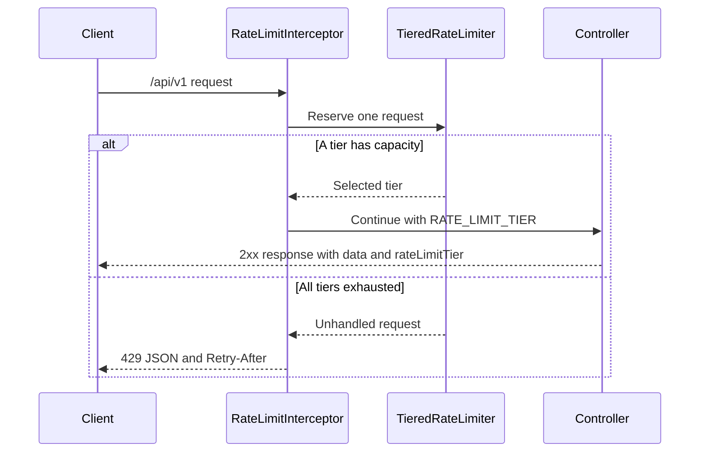

# Library Management API

A demo REST API for managing books, members, and loans. Built with Java 21 and Spring Boot 3.2.3, backed by Spring Data JPA and an H2 database for local development.


## Features

- Book CRUD, availability, and title/author search
- Google Books primary lookup with a local library fallback
- Member registration, updates, and soft deactivation
- Borrowing and returning with due dates and fines
- Transactional service operations and centralized error responses
- Tiered request admission with versioned API routes
- No authentication required for local demos
- Swagger UI, OpenAPI documentation, and H2 local database

## Data Sources

Book search uses the Google Books API first and falls back to local library data when the remote service is unavailable or returns no results. Search results identify their source as `google` or `local`; use `source=auto|google|local` to select a source.

The Google Books API key is optional. Set `GOOGLE_BOOKS_API_KEY` before starting the application to use one. Without a key, the application still starts and can use its local fallback.

## Requirements

- Java 21
- Maven 3.9+ (or the included Maven Wrapper)
- Git

## Run Locally

```powershell
./mvnw.cmd clean test
./mvnw.cmd spring-boot:run
```

The API starts at `http://localhost:8081`. No login or credentials are needed. Swagger is available at `/swagger-ui.html`, and the H2 console is at `/h2-console`.

Authentication is intentionally disabled for easy local demonstrations. Do not expose this demo to an untrusted network or use it as-is in production.

To exercise the endpoints, run `./test-all-endpoints.ps1` from the project directory and adjust its sample values as needed.

## API Endpoints

API endpoints are publicly accessible in this demo. Existing routes are available under `/api/` and also under `/api/v1/`; successful versioned responses include the result and selected rate-limit tier.

### Books

| Method | Endpoint | Description |
|---|---|---|
| GET | `/api/v1/books` | List all books |
| GET | `/api/v1/books/{id}` | Get one book |
| POST | `/api/v1/books` | Create a book |
| PUT | `/api/v1/books/{id}` | Update a book |
| DELETE | `/api/v1/books/{id}` | Delete a book |
| GET | `/api/v1/books/search?q=keyword&source=auto` | Search Google Books with local fallback |
| GET | `/api/v1/books/available` | List available books |

### Members

| Method | Endpoint | Description |
|---|---|---|
| GET | `/api/v1/members` | List members |
| GET | `/api/v1/members/{id}` | Get one member |
| POST | `/api/v1/members` | Register a member |
| PUT | `/api/v1/members/{id}` | Update a member |
| DELETE | `/api/v1/members/{id}` | Deactivate a member |

### Loans

| Method | Endpoint | Description |
|---|---|---|
| POST | `/api/v1/loans/borrow?bookId={bookId}&memberId={memberId}` | Borrow a book |
| PUT | `/api/v1/loans/return?loanId={loanId}` | Return a book |
| GET | `/api/v1/loans/active` | List active loans |
| GET | `/api/v1/loans/member/{memberId}` | List a member's active loans |

Successful versioned responses use an envelope such as:

```json
{"data":[],"rateLimitTier":"Tier 1 - Instant / Direct Processing"}
```

Invalid book or member payloads return HTTP 400. When all configured tier budgets are exhausted, the API returns HTTP 429 with `Retry-After` and `{"error":"Too Many Requests","message":"System saturated. Retry later."}`.

## Tiered Rate Limiter

The `HandlerInterceptor` greedily reserves request capacity from the instant tier, then the queue-buffer tier, then the manual/slow-buffer tier. These tiers are admission bands and response metadata; they do not dispatch work to an asynchronous queue or manual workflow. A shared fixed-window budget is replenished on the configured interval. The interceptor covers `/api/**`; actuator and Swagger documentation routes are excluded.



Adjust the budgets and window in `src/main/resources/application.properties`:

```properties
app.rate-limit.window-ms=60000
app.rate-limit.retry-after-seconds=60
app.rate-limit.tiers.instant-capacity=1000
app.rate-limit.tiers.queue-capacity=5000
app.rate-limit.tiers.manual-capacity=10000
```

## Example Requests

Create a book:

```bash
curl -X POST http://localhost:8081/api/v1/books \
  -H "Content-Type: application/json" \
  -d '{"title":"Clean Code","author":"Robert C. Martin","isbn":"9780132350884","publicationYear":2008}'
```

Search Google Books with local fallback, or force a local search:

```bash
curl "http://localhost:8081/api/v1/books/search?q=harry+potter"
curl "http://localhost:8081/api/v1/books/search?q=harry+potter&source=local"
```

Borrow a book:

```bash
curl -X POST "http://localhost:8081/api/v1/loans/borrow?bookId={bookId}&memberId={memberId}"
```

## Testing

Run the full suite:

```powershell
./mvnw.cmd clean test
```

Tests cover service behavior, application startup, unauthenticated demo access, versioned response metadata, validation, tier exhaustion, and legacy route compatibility.

## Project Structure

```text
src/main/java/com/daniel/library_management
├── config          # Rate limiter configuration
├── controller      # REST endpoints
├── exception       # API exception types and handler
├── limiter         # Tier hierarchy and greedy limiter
├── model           # JPA entities
├── repository      # Spring Data repositories
├── service         # Business rules and transactions
└── web             # Interceptor and versioned response envelope
```

## License

See [LICENSE](LICENSE).